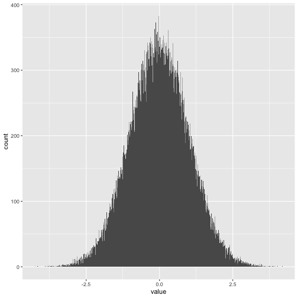

# Wrangling {#wrangling}

<!-- This is a change.  -->

<!-- Read the chapter very closely. Look again at the tutorials. Write lots of comments in the chapter.  -->

<!-- Read Instructions on Writing Tutorials.  -->

<!-- https://ppbds.github.io/primer.tutorials/articles/instructions.html -->

<!-- Start adding comments as PRs to the current tutorials.  -->

<!-- Take a look at our Chapter 5. Does our Distributions section help set the stage? -->


<!-- Replace flights with fec16? airlines are boring. Got rid of 538?  -->

<!-- Add in other join diagrams, like the one used for for inner join. -->

<!-- Start joins with left_join, since it is most important. -->


*Data science is data cleaning.*

Start by loading the packages which we will need in this chapter.


```r
library(tidyverse)
library(primer.data)
library(lubridate)
library(skimr)
library(nycflights13)
library(gapminder)
library(fivethirtyeight)
```

<!-- List these as bulleted lists so that they are easier to read. -->
<!-- AM: I don't recall if all 8 Tidyverse sub-packages are used in this chapter, but I'd say here which ones are actually used (such as stringr) -->
<!-- AM: 538's description is too vague - additionally, the actual usage of 538 in this chapter suggests more that it provides data, not that it cleans it up. I may be wrong, though. -->

* The **tidyverse** package will be used in every chapter. Loading it makes the 8 packages from the "Tidyverse" available.
* **primer.data** is the data package created specifically for the primer.
* **lubridate** is a package for working with dates and times.
* **skimr** contains functions that are useful for providing summary statistics, especially `skim()`.
* **nycflights13** includes data associated with flights out of New York City's three major airports.
* **gapminder** has annual data for countries going back more than 50 years, which we used in Chapter \@ref(visualization).
* **fivethirtyeight** cleans up data from the [FiveThirtyEight](https://fivethirtyeight.com/) team.

## Tibbles

<!-- AM: This description of a tibble is unnecessarily wordy. -->

Tibbles are a kind of data frame, useful for storing data in which we have the same number of observations for each variable. We can use the `tibble()` function to create tibbles. Tibbles are composed of columns, each of which is a variable, and rows, each of which is a "unit" or an "observation." Furthermore, each column (i.e., each variable) can be of a different type: character, integer, factor, double, date and so on.

<!-- Atilla: Tibble description was too long and ambiguous. I've broke it into multiple sentences with a little different wording. -->

### `tibble()`


```r
tibble(a = 2.1, b = "Hello", c = TRUE, d = 9L)
```

```
## # A tibble: 1 x 4
##       a b     c         d
##   <dbl> <chr> <lgl> <int>
## 1   2.1 Hello TRUE      9
```

<!-- AM: Also unnecessarily wordy. -->

In our code, we specify the variable names (or the names of columns) as , `a`, `b`, and `c`. Under each variable, we give a different value. Under each variable name, the data type is specified for the data within that column. A tibble can consist of one or more atomic vectors, the most important types of which are double, character, logical, and integer. The tibble above includes a variable of each type. The "L" in "9L" tells R that we want `d` to be an integer rather than the default, which would be a double. When you print out a tibble, the variable type is shown below the variable name.

<!--Atilla: "The "L" in "9L" tells R that we want `d" part is not necessarily an extra information. I think parentheses is unnecessary in this case. I've edited that.-->

<!-- Atilla: "When you print out a tibble, the variable type is shown below the variable name." sentence was implied in the preceding sentences. Therefore, I deleted that. -->

<!-- Add note about data in the wild. -->

Variables should not begin with a number (like `54abc`) or include spaces (like `my var`). If you insist on using variable names such, you must include backticks around each name when you reference it.

<!-- Atilla: Using such instead of 'like that' would be more appropriate and professional. Edited that way. -->


```r
tibble(`54abc` = 1, `my var` = 2, c = 3)
```

```
## # A tibble: 1 x 3
##   `54abc` `my var`     c
##     <dbl>    <dbl> <dbl>
## 1       1        2     3
```

If we did not include the backticks, R would give us an error.


```r
tibble(54abc = 1, my var = 2, c = 3)
```

```
## Error: <text>:1:10: unexpected symbol
## 1: tibble(54abc
##              ^
```

It is sometimes easier to use the function `tribble()` to create tibbles.


```r
tribble(
  ~ var1, ~ `var 2`, ~ myvar,
  1,           3,      5,
  4,           6,      8,
)
```

```
## # A tibble: 2 x 3
##    var1 `var 2` myvar
##   <dbl>   <dbl> <dbl>
## 1     1       3     5
## 2     4       6     8
```

The tildes --- as in `~ var1` --- specify which row has the column names. The formatting makes it easier, relative to specifying raw vectors, to see which values are from the same observation.

## Lists


Earlier, we briefly introduced lists. Lists are a type of vector that is a step up in complexity from atomic vectors, because lists can contain other lists. This makes them suitable for representing hierarchical or tree-like structures. You create a list with the function `list()`:


```r
x <- list(1, 2, 3)
x
```

```
## [[1]]
## [1] 1
## 
## [[2]]
## [1] 2
## 
## [[3]]
## [1] 3
```

A very useful tool for working with lists is `str()` because it focuses on displaying the **str**ucture, not the contents.


```r
str(x)
```

```
## List of 3
##  $ : num 1
##  $ : num 2
##  $ : num 3
```

```r
x_named <- list(a = 1, b = 2, c = 3)
str(x_named)
```

```
## List of 3
##  $ a: num 1
##  $ b: num 2
##  $ c: num 3
```

Unlike atomic vectors, `list()` can contain a mix of objects.


```r
y <- list("a", 1L, 1.5, TRUE)
str(y)
```

```
## List of 4
##  $ : chr "a"
##  $ : int 1
##  $ : num 1.5
##  $ : logi TRUE
```

Lists can even contain other lists!


```r
z <- list(list(1, 2), list(3, 4))
str(z)
```

```
## List of 2
##  $ :List of 2
##   ..$ : num 1
##   ..$ : num 2
##  $ :List of 2
##   ..$ : num 3
##   ..$ : num 4
```

### Visualizing lists

To explain more complicated list manipulation functions, it's helpful to have a visual representation of lists. For example, take these three lists:


```r
x1 <- list(c(1, 2), c(3, 4))
x2 <- list(list(1, 2), list(3, 4))
x3 <- list(1, list(2, list(3)))
```

I'll draw them as follows:


There are three principles:

1. Lists have rounded corners. Atomic vectors have square corners.

1. Children are drawn inside their parent, and have a slightly darker background to make it easier to see  the hierarchy.

1. The orientation of the children (i.e. rows or columns) isn't important, so I'll pick a row or column orientation to either save space or illustrate an important property in the example.

### Subsetting

There are three ways to subset a list, which I'll illustrate with a list named `a`:


```r
a <- list(a = 1:3, b = "a string", c = pi, d = list(-1, -5))
```

`[ ]` extracts a sub-list. The result will always be a list.


```r
str(a[1:2])
```

```
## List of 2
##  $ a: int [1:3] 1 2 3
##  $ b: chr "a string"
```

```r
str(a[4])
```

```
## List of 1
##  $ d:List of 2
##   ..$ : num -1
##   ..$ : num -5
```

Like with vectors, you can subset with a logical, integer, or character vector.
    
`[[ ]]` extracts a single component from a list. It removes a level of hierarchy from the list.


```r
str(a[[1]])
```

```
##  int [1:3] 1 2 3
```

```r
str(a[[4]])
```

```
## List of 2
##  $ : num -1
##  $ : num -5
```

`$` is a shorthand for extracting named elements of a list. It works similarly to `[[ ]]` except that you don't need to use quotes.
    

```r
a$a
```

```
## [1] 1 2 3
```

```r
a[["a"]]
```

```
## [1] 1 2 3
```

The distinction between `[ ]` and `[[ ]]` is really important for lists, because `[[ ]]` drills down into the list while `[ ]` returns a new, smaller list. Compare the code and output above with the visual representation.


## Characters 


<!-- AM: These first three sentences should preface the chapter. -->

So far, our tibbles have been clean and wholesome, like `gapminder` and `trains`. **Real data is nasty.** You will bring data into R from the outside world and discover there are problems. We will now discuss common remedial tasks for cleaning and transforming character data, also known as strings. A *string* is one or more characters that are enclosed inside a pair of matching 'single' or "double quotes".


We will use the `fruit` data, a vector with the names of different fruits, from the **stringr** package, which is automatically loaded when we issue `library(tidyverse)`. Although we can manipulate character vectors directly, it is much more common, in real world situations, to work with vectors which are in a tibble.


```r
tbl_fruit <- tibble(fruit = fruit)
```


### Character vectors


```r
tbl_fruit %>% 
  slice_sample(n = 8)
```

```
## # A tibble: 8 x 1
##   fruit       
##   <chr>       
## 1 eggplant    
## 2 bilberry    
## 3 currant     
## 4 mulberry    
## 5 chili pepper
## 6 ugli fruit  
## 7 blackcurrant
## 8 goji berry
```

Note that `slice_sample()` selects a random set of rows from the tibble. If you use the argument `n`, as here, you get back that many rows. Use the argue `prop` to return a specific percentage of all the rows in the tibble.

`str_detect()` determines if a character vector matches a pattern.  It returns a logical vector that is the same length as the input. Recall logicals are either `TRUE` or `FALSE`.

Which fruit names actually include the letter "c?"


```r
tbl_fruit %>% 
  mutate(fruit_in_name = str_detect(fruit, pattern = "c")) 
```

```
## # A tibble: 80 x 2
##    fruit        fruit_in_name
##    <chr>        <lgl>        
##  1 apple        FALSE        
##  2 apricot      TRUE         
##  3 avocado      TRUE         
##  4 banana       FALSE        
##  5 bell pepper  FALSE        
##  6 bilberry     FALSE        
##  7 blackberry   TRUE         
##  8 blackcurrant TRUE         
##  9 blood orange FALSE        
## 10 blueberry    FALSE        
## # … with 70 more rows
```


`str_length()` counts characters in your strings. Note this is different from the `length()` of the character vector itself.


```r
tbl_fruit %>% 
  mutate(name_length = str_length(fruit)) 
```

```
## # A tibble: 80 x 2
##    fruit        name_length
##    <chr>              <int>
##  1 apple                  5
##  2 apricot                7
##  3 avocado                7
##  4 banana                 6
##  5 bell pepper           11
##  6 bilberry               8
##  7 blackberry            10
##  8 blackcurrant          12
##  9 blood orange          12
## 10 blueberry              9
## # … with 70 more rows
```

`str_sub()` extracts parts of a string. The function takes start and end arguments which are vectorised.


```r
tbl_fruit %>% 
  mutate(first_three_letters = str_sub(fruit, 1, 3)) 
```

```
## # A tibble: 80 x 2
##    fruit        first_three_letters
##    <chr>        <chr>              
##  1 apple        app                
##  2 apricot      apr                
##  3 avocado      avo                
##  4 banana       ban                
##  5 bell pepper  bel                
##  6 bilberry     bil                
##  7 blackberry   bla                
##  8 blackcurrant bla                
##  9 blood orange blo                
## 10 blueberry    blu                
## # … with 70 more rows
```

`str_c()` combines a character vector of length to a single string. This is similar to the normal `c()` function for creating a vector.


```r
tbl_fruit %>% 
  mutate(name_with_s = str_c(fruit, "s")) 
```

```
## # A tibble: 80 x 2
##    fruit        name_with_s  
##    <chr>        <chr>        
##  1 apple        apples       
##  2 apricot      apricots     
##  3 avocado      avocados     
##  4 banana       bananas      
##  5 bell pepper  bell peppers 
##  6 bilberry     bilberrys    
##  7 blackberry   blackberrys  
##  8 blackcurrant blackcurrants
##  9 blood orange blood oranges
## 10 blueberry    blueberrys   
## # … with 70 more rows
```

`str_replace()` replaces a pattern within a string.


```r
tbl_fruit %>% 
  mutate(capital_A = str_replace(fruit, 
                                 pattern = "a", 
                                 replacement = "A")) 
```

```
## # A tibble: 80 x 2
##    fruit        capital_A   
##    <chr>        <chr>       
##  1 apple        Apple       
##  2 apricot      Apricot     
##  3 avocado      Avocado     
##  4 banana       bAnana      
##  5 bell pepper  bell pepper 
##  6 bilberry     bilberry    
##  7 blackberry   blAckberry  
##  8 blackcurrant blAckcurrant
##  9 blood orange blood orAnge
## 10 blueberry    blueberry   
## # … with 70 more rows
```


### Regular expressions with stringr

Sometimes, your string tasks cannot be expressed in terms of a fixed string, but can be described in terms of a pattern. Regular expressions, also know as "regexes," are the standard way to specify these patterns. In regexes, specific characters and constructs take on special meaning in order to match multiple strings.

To explore regular expressions, we will use the `str_detect()` function, which reports TRUE for any string which matches the pattern, and then `filter()` to see all the matches. For example, here are all the fruits which include a "w" in their name.


```r
tbl_fruit %>%
  filter(str_detect(fruit, pattern = "w"))
```

```
## # A tibble: 4 x 1
##   fruit     
##   <chr>     
## 1 honeydew  
## 2 kiwi fruit
## 3 strawberry
## 4 watermelon
```


In the code below, the first metacharacter is the period `.` , which stands for any single character, except a newline (which, by the way, is represented by `\n`). The regex `b.r` will match all fruits that have an "b", followed by any single character, followed by "r". Regexes are case sensitive.


```r
tbl_fruit %>%
  filter(str_detect(fruit, pattern = "b.r"))
```

```
## # A tibble: 15 x 1
##    fruit      
##    <chr>      
##  1 bilberry   
##  2 blackberry 
##  3 blueberry  
##  4 boysenberry
##  5 cloudberry 
##  6 cranberry  
##  7 cucumber   
##  8 elderberry 
##  9 goji berry 
## 10 gooseberry 
## 11 huckleberry
## 12 mulberry   
## 13 raspberry  
## 14 salal berry
## 15 strawberry
```

Anchors can be included to express where the expression must occur within the string. The `^` indicates the beginning of string and `$` indicates the end. 


```r
tbl_fruit %>%
  filter(str_detect(fruit, pattern = "^w"))
```

```
## # A tibble: 1 x 1
##   fruit     
##   <chr>     
## 1 watermelon
```


```r
tbl_fruit %>%
  filter(str_detect(fruit, pattern = "o$"))
```

```
## # A tibble: 5 x 1
##   fruit    
##   <chr>    
## 1 avocado  
## 2 mango    
## 3 pamelo   
## 4 pomelo   
## 5 tamarillo
```

<!-- We cut our raw strings from here. Bring back?   -->

## Factors

Factors are *categorical* variables that only take on a specified set of values. To manipulate factors we will use the **forcats** package, a core package in the Tidyverse. 


It is easy to make factors with either `factor()`, `as.factor()` or `parse_factor()`.


```r
tibble(X = letters[1:3]) %>% 
  mutate(fac_1 = factor(X)) %>% 
  mutate(fac_2 = as.factor(X)) %>% 
  mutate(fac_3 = parse_factor(X))
```

```
## # A tibble: 3 x 4
##   X     fac_1 fac_2 fac_3
##   <chr> <fct> <fct> <fct>
## 1 a     a     a     a    
## 2 b     b     b     b    
## 3 c     c     c     c
```

Which of those three options is best depends on the situation. `factor()` is useful when you are creating a factor from nothing. `as.factor()` is best for simple transformations, especially of character variables, as in this example. `parse_factor()` is the most modern and powerful of the three. 

<!-- DK: Too awkward! -->

Let's use `gapminder$continent` as an example. Note that `str()` is a useful function for getting detailed information about an object.


```r
str(gapminder$continent)
```

```
##  Factor w/ 5 levels "Africa","Americas",..: 3 3 3 3 3 3 3 3 3 3 ...
```

```r
levels(gapminder$continent)
```

```
## [1] "Africa"   "Americas" "Asia"     "Europe"   "Oceania"
```

```r
nlevels(gapminder$continent)
```

```
## [1] 5
```

```r
class(gapminder$continent)
```

```
## [1] "factor"
```

To get a frequency table as a tibble, from a tibble, use `count()`. To get a similar result from a free-range factor, use `fct_count()`.


```r
gapminder %>% 
  count(continent)
```

```
## # A tibble: 5 x 2
##   continent     n
##   <fct>     <int>
## 1 Africa      624
## 2 Americas    300
## 3 Asia        396
## 4 Europe      360
## 5 Oceania      24
```

```r
fct_count(gapminder$continent)
```

```
## # A tibble: 5 x 2
##   f            n
##   <fct>    <int>
## 1 Africa     624
## 2 Americas   300
## 3 Asia       396
## 4 Europe     360
## 5 Oceania     24
```

### Dropping unused levels

Removing all the rows corresponding to a specific factor level does not remove the level itself. These unused levels can come back to haunt you later, e.g., in figure legends.

Watch what happens to the levels of `country` when we filter `gapminder` to a handful of countries.


```r
nlevels(gapminder$country)
```

```
## [1] 142
```

```r
h_gap <- gapminder %>%
  filter(country %in% c("Egypt", "Haiti", 
                        "Romania", "Thailand", 
                        "Venezuela"))
nlevels(h_gap$country)
```

```
## [1] 142
```

Even though `h_gap` only has data for a handful of countries, we are still schlepping around all levels from the original `gapminder` tibble.

How can you get rid of them? The base function `droplevels()` operates on all the factors in a data frame or on a single factor. The function `fct_drop()` operates on a single factor variable.


```r
h_gap_dropped <- h_gap %>% 
  droplevels()
nlevels(h_gap_dropped$country)
```

```
## [1] 5
```

```r
# Use fct_drop() on a free-range factor

h_gap$country %>%
  fct_drop() %>%
  levels()
```

```
## [1] "Egypt"     "Haiti"     "Romania"   "Thailand"  "Venezuela"
```

### Change the order of the levels

By default, factor levels are ordered alphabetically. 


```r
gapminder$continent %>%
  levels()
```

```
## [1] "Africa"   "Americas" "Asia"     "Europe"   "Oceania"
```

We can also order factors by:

1. Frequency: Make the most common level the first and so on.
1. Another variable: Order factor levels according to a summary statistic for another variable.

Let's order continent by frequency using `fct_infreq()`.


```r
gapminder$continent %>% 
  fct_infreq() %>%
  levels()
```

```
## [1] "Africa"   "Asia"     "Europe"   "Americas" "Oceania"
```

We can also have the frequency print out backwards using `fct_rev()`.


```r
gapminder$continent %>% 
  fct_infreq() %>%
  fct_rev() %>% 
  levels()
```

```
## [1] "Oceania"  "Americas" "Europe"   "Asia"     "Africa"
```

These two bar charts of frequency by continent differ only in the order of the continents. Which do you prefer? We show the code for just the second one.


```r
gapminder %>% 
  mutate(continent = fct_infreq(continent)) %>% 
  mutate(continent = fct_rev(continent)) %>% 
  ggplot(aes(x = continent)) +
    geom_bar() +
    coord_flip()
```


Let's now order `country` by another variable, forwards and backwards. This other variable is usually quantitative and you will order the factor according to a grouped summary. The factor is the grouping variable and the default summarizing function is `median()` but you can specify something else.


```r
# Order countries by median life expectancy

fct_reorder(gapminder$country, 
            gapminder$lifeExp) %>% 
  levels() %>% 
  head()
```

```
## [1] "Sierra Leone"  "Guinea-Bissau" "Afghanistan"   "Angola"        "Somalia"       "Guinea"
```

```r
# Order according to minimum life exp instead of median

fct_reorder(gapminder$country, 
            gapminder$lifeExp, min) %>% 
  levels() %>% 
  head()
```

```
## [1] "Rwanda"       "Afghanistan"  "Gambia"       "Angola"       "Sierra Leone" "Cambodia"
```

```r
# Backwards!

fct_reorder(gapminder$country, 
            gapminder$lifeExp, 
            .desc = TRUE) %>% 
  levels() %>% 
  head()
```

```
## [1] "Iceland"     "Japan"       "Sweden"      "Switzerland" "Netherlands" "Norway"
```

Why do we reorder factor levels? It often makes plots much better! When plotting a factor against a numeric variable, it is generally a good idea to order the factors by some function of the numeric variable. Alphabetic ordering is rarely best.

Compare the interpretability of these two plots of life expectancy in the Aericas in 2007. The only difference is the order of the `country` factor. Which is better?


```r
gapminder %>% 
  filter(year == 2007, 
         continent == "Americas") %>% 
  ggplot(aes(x = lifeExp, y = country)) + 
    geom_point()
```


```r
gapminder %>% 
  filter(year == 2007, 
         continent == "Americas") %>% 
  ggplot(aes(x = lifeExp, 
             y = fct_reorder(country, lifeExp))) + 
    geom_point()
```


<!-- Use `fct_reorder2()` when you have a line chart of a quantitative x against another quantitative y and your factor provides the color. This way the legend appears in the same order as the data! Note, the order is taken by the right side of the plot (not the left). Contrast the legend on the left with the one on the right.  -->

<!-- ```{r legends-made-for-humans, fig.show = 'hold', out.width = '49%', out.height="80%", echo = FALSE} -->
<!-- h_countries <- c("Egypt", "Haiti", "Romania", "Thailand", "Venezuela") -->
<!-- h_gap <- gapminder %>% -->
<!--   filter(country %in% h_countries) %>%  -->
<!--   droplevels() -->
<!-- ggplot(h_gap, aes(x = year, y = lifeExp, color = country)) + -->
<!--   geom_line() -->
<!-- ggplot(h_gap, aes(x = year, y = lifeExp, -->
<!--                   color = fct_reorder2(country, year, lifeExp))) + -->
<!--   geom_line() + -->
<!--   labs(color = "country") -->
<!-- ``` -->

<!-- Sometimes you just want to hoist one or more levels to the front. Why? Because we said so. This resembles what we do when we move variables to the front with `dplyr::select(special_var, everything())`. -->

<!-- ```{r} -->
<!-- h_gap$country %>%  -->
<!--   levels() -->

<!-- h_gap$country %>%  -->
<!--   fct_relevel("Romania", "Haiti") %>%  -->
<!--   levels() -->
<!-- ``` -->

<!-- This might be useful if you are preparing a report for, say, the Romanian government. The reason for always putting Romania first has nothing to do with the data, it is important for external reasons and you need a way to express this. -->

### Recode the levels

Use `fct_recode()` to change the names of the levels for a factor.


```r
i_gap <- gapminder %>% 
  filter(country %in% c("United States", "Sweden", 
                        "Australia")) %>% 
  droplevels()

i_gap$country %>% 
  levels()
```

```
## [1] "Australia"     "Sweden"        "United States"
```

```r
i_gap$country %>%
  fct_recode("USA" = "United States", "Oz" = "Australia") %>% 
  levels()
```

```
## [1] "Oz"     "Sweden" "USA"
```


## Date-Times 

We will manipulate date-times using the **lubridate** package because lubridate makes it easier to work with dates and times in R. **lubridate** is not part of the core tidyverse because you only need it when you're working with dates/times.


There are three types of date/time data that refer to an instant in time:

* A `date`. Tibbles print this as `<date>`.

* A `time` within a day. Tibbles print this as `<time>`.

* A `date-time` is a date plus a time. It uniquely identifies an
  instant in time (typically to the nearest second). Tibbles print this
  as `<dttm>`.

You should always use the simplest possible data type that works for your needs. That means if you can use a date instead of a date-time, you should. Date-times are substantially more complicated because of the need to handle time zones, which we'll come back to at the end of the chapter.

To get the current date or date-time you can use `today()` or `now()`:


```r
today()
```

```
## [1] "2021-07-08"
```

```r
now()
```

```
## [1] "2021-07-08 09:05:31 EDT"
```

Otherwise, there are three ways you're likely to create a date/time:

1. From a string.
1. From individual date-time components.
1. From an existing date/time object.

They work as follows:

### From strings

Date/time data often comes as strings. The **lubridate** functions automatically work out the format once you specify the order of the component. First, figure out that you want the order in which year, month, and day appear in your dates, then arrange "y", "m", and "d" accordingly. That gives you the name of the **lubridate** function that will parse your date. For example:


```r
ymd("2017-01-31")
```

```
## [1] "2017-01-31"
```

```r
mdy("January 31st, 2017")
```

```
## [1] "2017-01-31"
```

```r
dmy("31-Jan-2017")
```

```
## [1] "2017-01-31"
```

These functions also take unquoted numbers. This is the most concise way to create a single date/time object, as you might need when filtering date/time data. `ymd()` is short and unambiguous:


```r
ymd(20170131)
```

```
## [1] "2017-01-31"
```

`ymd()` and friends create dates. To create a date-time, add an underscore and one or more of "h", "m", and "s" to the name of the parsing function:


```r
ymd_hms("2017-01-31 20:11:59")
```

```
## [1] "2017-01-31 20:11:59 UTC"
```

```r
mdy_hm("01/31/2017 08:01")
```

```
## [1] "2017-01-31 08:01:00 UTC"
```

You can also force the creation of a date-time from a date by supplying a timezone:


```r
ymd(20170131, tz = "UTC")
```

```
## [1] "2017-01-31 UTC"
```


### From individual components

Instead of a single string, sometimes you'll have the individual components of the date-time spread across multiple columns. This is what we have in the flights data:


```r
flights %>% 
  select(year, month, day, hour, minute)
```

```
## # A tibble: 336,776 x 5
##     year month   day  hour minute
##    <int> <int> <int> <dbl>  <dbl>
##  1  2013     1     1     5     15
##  2  2013     1     1     5     29
##  3  2013     1     1     5     40
##  4  2013     1     1     5     45
##  5  2013     1     1     6      0
##  6  2013     1     1     5     58
##  7  2013     1     1     6      0
##  8  2013     1     1     6      0
##  9  2013     1     1     6      0
## 10  2013     1     1     6      0
## # … with 336,766 more rows
```

To create a date/time from this sort of input, use `make_date()` for dates, or `make_datetime()` for date-times:


```r
flights %>% 
  select(year, month, day, hour, minute) %>% 
  mutate(departure = make_datetime(year, month, day, hour, minute))
```

```
## # A tibble: 336,776 x 6
##     year month   day  hour minute departure          
##    <int> <int> <int> <dbl>  <dbl> <dttm>             
##  1  2013     1     1     5     15 2013-01-01 05:15:00
##  2  2013     1     1     5     29 2013-01-01 05:29:00
##  3  2013     1     1     5     40 2013-01-01 05:40:00
##  4  2013     1     1     5     45 2013-01-01 05:45:00
##  5  2013     1     1     6      0 2013-01-01 06:00:00
##  6  2013     1     1     5     58 2013-01-01 05:58:00
##  7  2013     1     1     6      0 2013-01-01 06:00:00
##  8  2013     1     1     6      0 2013-01-01 06:00:00
##  9  2013     1     1     6      0 2013-01-01 06:00:00
## 10  2013     1     1     6      0 2013-01-01 06:00:00
## # … with 336,766 more rows
```

### From other types

You may want to switch between a date-time and a date. That's the job of `as_datetime()` and `as_date()`:


```r
as_datetime(today())
```

```
## [1] "2021-07-08 UTC"
```

```r
as_date(now())
```

```
## [1] "2021-07-08"
```

Sometimes you'll get date/times as numeric offsets from the "Unix Epoch", 1970-01-01. If the offset is in seconds, use `as_datetime()`; if it's in days, use `as_date()`.

<!-- Atilla: This section seems ambiguous. I feel like what the code below does and what the offset from "Unix Epoch" should be more clearly explained.-->


```r
as_datetime(60 * 60 * 10)
```

```
## [1] "1970-01-01 10:00:00 UTC"
```

```r
as_date(365 * 10 + 2)
```

```
## [1] "1980-01-01"
```

### Date-time components

Now that you know how to get date-time data into R's date-time data structures, let's explore what you can do with them. This section will focus on the accessor functions that let you get and set individual components. The next section will look at how arithmetic works with date-times.

You can pull out individual parts of the date with the accessor functions `year()`, `month()`, `mday()` (day of the month), `yday()` (day of the year), `wday()` (day of the week), `hour()`, `minute()`, and `second()`. 


```r
datetime <- ymd_hms("2016-07-08 12:34:56")
year(datetime)
```

```
## [1] 2016
```

```r
month(datetime)
```

```
## [1] 7
```

```r
mday(datetime)
```

```
## [1] 8
```

```r
yday(datetime)
```

```
## [1] 190
```

```r
wday(datetime)
```

```
## [1] 6
```

For `month()` and `wday()` you can set `label = TRUE` to return the abbreviated name of the month or day of the week. Set both `label = TRUE` and `abbr = FALSE` to return the full name.


```r
month(datetime, label = TRUE)
```

```
## [1] Jul
## Levels: Jan < Feb < Mar < Apr < May < Jun < Jul < Aug < Sep < Oct < Nov < Dec
```

```r
wday(datetime, label = TRUE, abbr = FALSE)
```

```
## [1] Friday
## Levels: Sunday < Monday < Tuesday < Wednesday < Thursday < Friday < Saturday
```


### Setting components

You can create a new date-time with `update()`.


```r
update(datetime, year = 2020, month = 2, mday = 2, hour = 2)
```

```
## [1] "2020-02-02 02:34:56 UTC"
```

If values are too big, they will roll-over:


```r
ymd("2015-02-01") %>% 
  update(mday = 30)
```

```
## [1] "2015-03-02"
```

```r
ymd("2015-02-01") %>% 
  update(hour = 400)
```

```
## [1] "2015-02-17 16:00:00 UTC"
```


### Time zones 

Time zones are an enormously complicated topic because of their interaction with geopolitical entities. Fortunately, we don't need to dig into all the details as they're not all imperative for data analysis. You can see the complete list of possible timezones with the function `OlsonNames()`. Unless otherwise specified, **lubridate** always uses UTC (Coordinated Universal Time).

In R, the time zone is an attribute of the date-time that only controls printing. For example, these three objects represent the same instant in time:


```r
(x1 <- ymd_hms("2015-06-01 12:00:00", tz = "America/New_York"))
```

```
## [1] "2015-06-01 12:00:00 EDT"
```

```r
(x2 <- ymd_hms("2015-06-01 18:00:00", tz = "Europe/Copenhagen"))
```

```
## [1] "2015-06-01 18:00:00 CEST"
```

```r
(x3 <- ymd_hms("2015-06-02 04:00:00", tz = "Pacific/Auckland"))
```

```
## [1] "2015-06-02 04:00:00 NZST"
```

## Combining Data

There are many ways to bring data together. 


The `bind_rows()` function is used to combine all the rows from two or more tibbles.


```r
data_1 <- tibble(x = 1:2,                
                 y = c("A", "B")) 

data_2 <- tibble(x = 3:4,
                 y = c("C", "D")) 


bind_rows(data_1, data_2)
```

```
## # A tibble: 4 x 2
##       x y    
##   <int> <chr>
## 1     1 A    
## 2     2 B    
## 3     3 C    
## 4     4 D
```


### Joins


Consider two tibbles: `superheroes` and `publishers`.


```r
superheroes <- tibble::tribble(
       ~name,   ~gender,     ~publisher,
   "Magneto",   "male",       "Marvel",
     "Storm",   "female",     "Marvel",
    "Batman",   "male",       "DC",
  "Catwoman",   "female",     "DC",
   "Hellboy",   "male",       "Dark Horse Comics"
  )

publishers <- tibble::tribble(
  ~publisher, ~yr_founded,
        "DC",       1934L,
    "Marvel",       1939L,
     "Image",       1992L
  )
```

Note how easy it is to use `tribble()` from the **tibble** package to create a tibble on the fly using text which organized for easy entry and reading. Recall that a double colon --- `::` --- is how we indicate that a function comes from a specific package.

#### `inner_join()`

<!-- Instead show a diagram of left_join() and briefly cover the rest of the joins, as left_join() is by far the most commonly-used join method. -->

`inner_join(x, y)`: Returns all rows from `x` where there are matching values in `y`, and all columns from `x` and `y`. If there are multiple matches between `x` and `y`, all combination of the matches are returned. 


```r
inner_join(superheroes, publishers)
```

```
## Joining, by = "publisher"
```

```
## # A tibble: 4 x 4
##   name     gender publisher yr_founded
##   <chr>    <chr>  <chr>          <int>
## 1 Magneto  male   Marvel          1939
## 2 Storm    female Marvel          1939
## 3 Batman   male   DC              1934
## 4 Catwoman female DC              1934
```

We lose Hellboy in the join because, although he appears in `x = superheroes`, his publisher Dark Horse Comics does not appear in `y = publishers`. The join result has all variables from `x = superheroes` plus `yr_founded`, from `y`.

Note the message that we are 'Joining, by = "publisher"'. Whenever joining, R checks to see if there are variables in common between the two tibbles and, if there are, uses them to join. However, it is concerned that you may not be aware that this is what it is doing, so R tells you. Such messages are both annoying and a signal that we have not made our code as robust as we should. Fortunately, we can specify precisely which variables we want to join by. Always do this.


```r
inner_join(superheroes, publishers, by = "publisher")
```

`by` also takes a vector of key variables if you want to merge by multiple variables.

Now compare this result to that of using `inner_join()` with the two datasets in opposite positions. 


```r
inner_join(publishers, superheroes, by = "publisher")
```

```
## # A tibble: 4 x 4
##   publisher yr_founded name     gender
##   <chr>          <int> <chr>    <chr> 
## 1 DC              1934 Batman   male  
## 2 DC              1934 Catwoman female
## 3 Marvel          1939 Magneto  male  
## 4 Marvel          1939 Storm    female
```

In a way, this does illustrate multiple matches, if you think about it from the `x = publishers` direction. Every publisher that has a match in `y = superheroes` appears multiple times in the result, once for each match. In fact, we're getting the same result as with `inner_join(superheroes, publishers)`, up to variable order (which you should also never rely on in an analysis).

#### `full_join()`

`full_join(x, y)`: Returns all rows and all columns from both `x` and `y`. Where there are not matching values, returns `NA` for the one missing. 


```r
full_join(superheroes, publishers, by = "publisher")
```

```
## # A tibble: 6 x 4
##   name     gender publisher         yr_founded
##   <chr>    <chr>  <chr>                  <int>
## 1 Magneto  male   Marvel                  1939
## 2 Storm    female Marvel                  1939
## 3 Batman   male   DC                      1934
## 4 Catwoman female DC                      1934
## 5 Hellboy  male   Dark Horse Comics         NA
## 6 <NA>     <NA>   Image                   1992
```

We get all rows of `x = superheroes` plus a new row from `y = publishers`, containing the publisher Image. We get all variables from `x = superheroes` AND all variables from `y = publishers`. Any row that derives solely from one table or the other carries `NA`s in the variables found only in the other table.


Because `full_join()` returns all rows and all columns from both `x` and `y`, the result of `full_join(x = superheroes, y = publishers)` should match that of `full_join(x = publishers, y = superheroes)`.

#### `left_join()`

`left_join(x, y)`: Returns all rows from `x`, and all columns from `x` and `y`. If there are multiple matches between `x` and `y`, all combination of the matches are returned. 


```r
left_join(superheroes, publishers, by = "publisher")
```

```
## # A tibble: 5 x 4
##   name     gender publisher         yr_founded
##   <chr>    <chr>  <chr>                  <int>
## 1 Magneto  male   Marvel                  1939
## 2 Storm    female Marvel                  1939
## 3 Batman   male   DC                      1934
## 4 Catwoman female DC                      1934
## 5 Hellboy  male   Dark Horse Comics         NA
```

We basically get `x = superheroes` back, but with an additional variable `yr_founded`, which is unique to `y = publishers`. Hellboy, whose publisher does not appear in `y = publishers`, has an `NA` for `yr_founded`.

Now compare this result to that of running `left_join(x = publishers, y = superheroes)`. Unlike `inner_join()` and `full_join()` the order of the arguments has a significant effect on the resulting tibble. 


```r
left_join(publishers, superheroes, by = "publisher")
```

```
## # A tibble: 5 x 4
##   publisher yr_founded name     gender
##   <chr>          <int> <chr>    <chr> 
## 1 DC              1934 Batman   male  
## 2 DC              1934 Catwoman female
## 3 Marvel          1939 Magneto  male  
## 4 Marvel          1939 Storm    female
## 5 Image           1992 <NA>     <NA>
```

We get a similar result as with `inner_join()`, but the publisher Image survives in the join, even though no superheroes from Image appear in `y = superheroes`. As a result, Image has `NA`s for `name` and `gender`.

There is a similar function, `right_join(x, y)` that returns all rows from `y`, and all columns from `x` and `y`. 

#### `semi_join()`

`semi_join(x, y)`: Returns all rows from `x` where there are matching values in `y`, keeping just columns from `x`. A semi join differs from an inner join because an inner join will return one row of `x` for each matching row of `y`, whereas a semi join will never duplicate rows of `x`. This is a filtering join.


```r
semi_join(superheroes, publishers, by = "publisher")
```

```
## # A tibble: 4 x 3
##   name     gender publisher
##   <chr>    <chr>  <chr>    
## 1 Magneto  male   Marvel   
## 2 Storm    female Marvel   
## 3 Batman   male   DC       
## 4 Catwoman female DC
```

Compare the result of switching the values of the arguments. 


```r
semi_join(x = publishers, y = superheroes, by = "publisher")
```

```
## # A tibble: 2 x 2
##   publisher yr_founded
##   <chr>          <int>
## 1 DC              1934
## 2 Marvel          1939
```

Now the effects of switching the `x` and `y` roles is more clear. The result resembles `x = publishers`, but the publisher Image is lost, since there are no observations where `publisher == "Image"` in `y = superheroes`.

#### `anti_join()`

`anti_join(x, y)`: Return all rows from `x` where there are no matching values in `y`, keeping just columns from `x`. 


```r
anti_join(superheroes, publishers, by = "publisher")
```

```
## # A tibble: 1 x 3
##   name    gender publisher        
##   <chr>   <chr>  <chr>            
## 1 Hellboy male   Dark Horse Comics
```

We keep only Hellboy now.

<!-- Atilla: I've removed the "and do not get `yr_founded` " phrase from the sentence "We keep only Hellboy now (and do not get `yr_founded`). " It is already stated in the past sentences. It was given in the  previous sentence that " keeping just columns from x." -->

Now switch the arguments and compare the result.


```r
anti_join(publishers, superheroes, by = "publisher")
```

```
## # A tibble: 1 x 2
##   publisher yr_founded
##   <chr>          <int>
## 1 Image           1992
```

We keep only publisher Image now (and the variables found in `x = publishers`).


### Example

Consider the relationships among the tibbles in the **nycflights13** package:


In both the `flights` and `airlines` data frames, the key variable we want to join/merge/match the rows by has the same name: `carrier`. Let's use `inner_join()` to join the two data frames, where the rows will be matched by the variable `carrier`


```r
flights %>% 
  inner_join(airlines, by = "carrier")
```

```
## # A tibble: 336,776 x 20
##     year month   day dep_time sched_dep_time dep_delay arr_time sched_arr_time arr_delay carrier flight tailnum
##    <int> <int> <int>    <int>          <int>     <dbl>    <int>          <int>     <dbl> <chr>    <int> <chr>  
##  1  2013     1     1      517            515         2      830            819        11 UA        1545 N14228 
##  2  2013     1     1      533            529         4      850            830        20 UA        1714 N24211 
##  3  2013     1     1      542            540         2      923            850        33 AA        1141 N619AA 
##  4  2013     1     1      544            545        -1     1004           1022       -18 B6         725 N804JB 
##  5  2013     1     1      554            600        -6      812            837       -25 DL         461 N668DN 
##  6  2013     1     1      554            558        -4      740            728        12 UA        1696 N39463 
##  7  2013     1     1      555            600        -5      913            854        19 B6         507 N516JB 
##  8  2013     1     1      557            600        -3      709            723       -14 EV        5708 N829AS 
##  9  2013     1     1      557            600        -3      838            846        -8 B6          79 N593JB 
## 10  2013     1     1      558            600        -2      753            745         8 AA         301 N3ALAA 
## # … with 336,766 more rows, and 8 more variables: origin <chr>, dest <chr>, air_time <dbl>, distance <dbl>,
## #   hour <dbl>, minute <dbl>, time_hour <dttm>, name <chr>
```

This is our first example of using a join function with a pipe. `flights` is fed as the first argument to `inner_join()`. That is what the pipe does. The above code is equivalent to:


```r
inner_join(flights, airlines, by = "carrier")
```

The `airports` data frame contains the airport codes for each airport:


```r
airports
```

```
## # A tibble: 1,458 x 8
##    faa   name                             lat    lon   alt    tz dst   tzone              
##    <chr> <chr>                          <dbl>  <dbl> <dbl> <dbl> <chr> <chr>              
##  1 04G   Lansdowne Airport               41.1  -80.6  1044    -5 A     America/New_York   
##  2 06A   Moton Field Municipal Airport   32.5  -85.7   264    -6 A     America/Chicago    
##  3 06C   Schaumburg Regional             42.0  -88.1   801    -6 A     America/Chicago    
##  4 06N   Randall Airport                 41.4  -74.4   523    -5 A     America/New_York   
##  5 09J   Jekyll Island Airport           31.1  -81.4    11    -5 A     America/New_York   
##  6 0A9   Elizabethton Municipal Airport  36.4  -82.2  1593    -5 A     America/New_York   
##  7 0G6   Williams County Airport         41.5  -84.5   730    -5 A     America/New_York   
##  8 0G7   Finger Lakes Regional Airport   42.9  -76.8   492    -5 A     America/New_York   
##  9 0P2   Shoestring Aviation Airfield    39.8  -76.6  1000    -5 U     America/New_York   
## 10 0S9   Jefferson County Intl           48.1 -123.    108    -8 A     America/Los_Angeles
## # … with 1,448 more rows
```

However, if you look at both the `airports` and `flights` data frames, you'll find that the airport codes are in variables that have different names. In `airports` the airport code is in `faa`, whereas in `flights` the airport codes are in `origin` and `dest`. 

In order to join these two data frames by airport code, our `inner_join()` operation will use `by = c("dest" = "faa")` thereby allowing us to join two data frames where the key variable has a different name.


```r
flights %>% 
  inner_join(airports, by = c("dest" = "faa"))
```

```
## # A tibble: 329,174 x 26
##     year month   day dep_time sched_dep_time dep_delay arr_time sched_arr_time arr_delay carrier flight tailnum
##    <int> <int> <int>    <int>          <int>     <dbl>    <int>          <int>     <dbl> <chr>    <int> <chr>  
##  1  2013     1     1      517            515         2      830            819        11 UA        1545 N14228 
##  2  2013     1     1      533            529         4      850            830        20 UA        1714 N24211 
##  3  2013     1     1      542            540         2      923            850        33 AA        1141 N619AA 
##  4  2013     1     1      554            600        -6      812            837       -25 DL         461 N668DN 
##  5  2013     1     1      554            558        -4      740            728        12 UA        1696 N39463 
##  6  2013     1     1      555            600        -5      913            854        19 B6         507 N516JB 
##  7  2013     1     1      557            600        -3      709            723       -14 EV        5708 N829AS 
##  8  2013     1     1      557            600        -3      838            846        -8 B6          79 N593JB 
##  9  2013     1     1      558            600        -2      753            745         8 AA         301 N3ALAA 
## 10  2013     1     1      558            600        -2      849            851        -2 B6          49 N793JB 
## # … with 329,164 more rows, and 14 more variables: origin <chr>, dest <chr>, air_time <dbl>, distance <dbl>,
## #   hour <dbl>, minute <dbl>, time_hour <dttm>, name <chr>, lat <dbl>, lon <dbl>, alt <dbl>, tz <dbl>, dst <chr>,
## #   tzone <chr>
```

Let's construct the chain of pipe operators `%>%` that computes the number of flights from NYC to each destination, but also includes information about each destination airport:


```r
flights %>%
  group_by(dest) %>%
  summarize(num_flights = n(),
            .groups = "drop") %>%
  arrange(desc(num_flights)) %>%
  inner_join(airports, by = c("dest" = "faa")) %>%
  rename(airport_name = name)
```

```
## # A tibble: 101 x 9
##    dest  num_flights airport_name                         lat    lon   alt    tz dst   tzone              
##    <chr>       <int> <chr>                              <dbl>  <dbl> <dbl> <dbl> <chr> <chr>              
##  1 ORD         17283 Chicago Ohare Intl                  42.0  -87.9   668    -6 A     America/Chicago    
##  2 ATL         17215 Hartsfield Jackson Atlanta Intl     33.6  -84.4  1026    -5 A     America/New_York   
##  3 LAX         16174 Los Angeles Intl                    33.9 -118.    126    -8 A     America/Los_Angeles
##  4 BOS         15508 General Edward Lawrence Logan Intl  42.4  -71.0    19    -5 A     America/New_York   
##  5 MCO         14082 Orlando Intl                        28.4  -81.3    96    -5 A     America/New_York   
##  6 CLT         14064 Charlotte Douglas Intl              35.2  -80.9   748    -5 A     America/New_York   
##  7 SFO         13331 San Francisco Intl                  37.6 -122.     13    -8 A     America/Los_Angeles
##  8 FLL         12055 Fort Lauderdale Hollywood Intl      26.1  -80.2     9    -5 A     America/New_York   
##  9 MIA         11728 Miami Intl                          25.8  -80.3     8    -5 A     America/New_York   
## 10 DCA          9705 Ronald Reagan Washington Natl       38.9  -77.0    15    -5 A     America/New_York   
## # … with 91 more rows
```

`"ORD"` is the airport code of Chicago O'Hare airport and `"FLL"` is the code for the main airport in Fort Lauderdale, Florida, which can be seen in the `airport_name` variable.


## Tidy data


Consider the first five rows from the `drinks` data frame from the **fivethirtyeight** package:


```
## # A tibble: 5 x 5
##   country     beer_servings spirit_servings wine_servings total_litres_of_pure_alcohol
##   <chr>               <int>           <int>         <int>                        <dbl>
## 1 Afghanistan             0               0             0                          0  
## 2 Albania                89             132            54                          4.9
## 3 Algeria                25               0            14                          0.7
## 4 Andorra               245             138           312                         12.4
## 5 Angola                217              57            45                          5.9
```

After reading the help file by running `?drinks`, you'll see that `drinks` is a data frame that contains the results from a survey of the average number of servings of beer, spirits, and wine consumed in 193 countries. This data was originally reported on FiveThirtyEight.com in Mona Chalabi's article: ["Dear Mona Followup: Where Do People Drink The Most Beer, Wine And Spirits?"](https://fivethirtyeight.com/features/dear-mona-followup-where-do-people-drink-the-most-beer-wine-and-spirits/).

Let's apply some of the data wrangling verbs on the `drinks` data frame:

1. `filter()` the `drinks` data frame to only consider 4 countries: the United States, China, Italy, and Saudi Arabia, *then*
1. `select()` all columns except `total_litres_of_pure_alcohol` by using the `-` sign, *then*
1. `rename()` the variables `beer_servings`, `spirit_servings`, and `wine_servings` to `beer`, `spirit`, and `wine`, respectively.

We will save the resulting data frame in `drinks_smaller`.


```r
drinks_smaller <- drinks %>%
  filter(country %in% c("USA", "China", "Italy", "Saudi Arabia")) %>%
  select(-total_litres_of_pure_alcohol) %>%
  rename(beer = beer_servings, spirit = spirit_servings, wine = wine_servings)
drinks_smaller
```

```
## # A tibble: 4 x 4
##   country       beer spirit  wine
##   <chr>        <int>  <int> <int>
## 1 China           79    192     8
## 2 Italy           85     42   237
## 3 Saudi Arabia     0      5     0
## 4 USA            249    158    84
```


### Definition of "tidy" data 

What does it mean for your data to be "tidy"? While "tidy" has a clear English meaning of "organized," the word "tidy" in data science using R means that your data follows a standardized format. 

"Tidy" data is a standard way of mapping the meaning of a dataset to its structure. A dataset is messy or tidy depending on how rows, columns and tables are matched up with observations, variables and types. In *tidy data*:

1. Each variable forms a column.
2. Each observation forms a row.
3. Each type of observational unit forms a table.


### Converting to "tidy" data

In this book so far, you've only seen data frames that were already in "tidy" format. Furthermore, for the rest of this book, you'll mostly only see data frames that are already tidy as well. This is not always the case, however, with all datasets in the world. If your original data frame is in wide (non-"tidy") format and you would like to use the **ggplot2** or **dplyr** packages, you will first have to convert it to "tidy" format. To do so, we recommend using the `pivot_longer()` function in the **tidyr** package [@R-tidyr]. 

<!-- Atilla: I feel like phrase "tidy" format is repetitively used and is awk. Therefore, I replaced some of the "'tidy' format" phrases with tidy.  -->

Going back to our `drinks_smaller` data frame from earlier:


```r
drinks_smaller
```

```
## # A tibble: 4 x 4
##   country       beer spirit  wine
##   <chr>        <int>  <int> <int>
## 1 China           79    192     8
## 2 Italy           85     42   237
## 3 Saudi Arabia     0      5     0
## 4 USA            249    158    84
```

We tidy it by using the `pivot_longer()` function from the **tidyr** package as follows:


```r
drinks_smaller_tidy <- drinks_smaller %>% 
  pivot_longer(names_to = "type", 
               values_to = "servings", 
               cols = -country)
drinks_smaller_tidy
```

```
## # A tibble: 12 x 3
##    country      type   servings
##    <chr>        <chr>     <int>
##  1 China        beer         79
##  2 China        spirit      192
##  3 China        wine          8
##  4 Italy        beer         85
##  5 Italy        spirit       42
##  6 Italy        wine        237
##  7 Saudi Arabia beer          0
##  8 Saudi Arabia spirit        5
##  9 Saudi Arabia wine          0
## 10 USA          beer        249
## 11 USA          spirit      158
## 12 USA          wine         84
```

Let's dissect the arguments to `pivot_longer()`.

1. the first argument`names_to` corresponds to the name of the variable in the new "tidy"/long data frame that will contain the *column names* of the original data. Observe how we set `names_to = "type"`. In the resulting `drinks_smaller_tidy`, the column `type` contains the three types of alcohol `beer`, `spirit`, and `wine`. Since `type` is a variable name that doesn't appear in `drinks_smaller`, we use quotation marks around it. You'll receive an error if you just use `names_to = type` here.

1. The second argument `values_to` corresponds to the name of the variable in the new "tidy" data frame that will contain the *values* of the original data. Observe how we set `values_to = "servings"` since each numeric value in the `beer`, `wine`, and `spirit` columns of the `drinks_smaller` corresponds to a value of `servings`. In the resulting `drinks_smaller_tidy`, the column `servings` contains the 4 $\times$ 3 = 12 numerical values. Note again that `servings` doesn't appear as a variable in `drinks_smaller` so it again needs quotation marks around it for the `values_to` argument.

1. The third argument `cols` is the columns in the `drinks_smaller` data frame you either want to or don't want to "tidy." Observe how we set this to `-country` indicating that we don't want to "tidy" the `country` variable in `drinks_smaller` and rather only `beer`, `spirit`, and `wine`. Since `country` is a column that appears in `drinks_smaller` we don't put quotation marks around it.

The third argument here of `cols` is a little nuanced, so let's consider code that was written slightly differently but that produces the same output: 


```r
drinks_smaller %>% 
  pivot_longer(names_to = "type", 
               values_to = "servings", 
               cols = c(beer, spirit, wine))
```

Note that the third argument now specifies which columns we want to "tidy" with `c(beer, spirit, wine)`, instead of the columns we don't want to "tidy" using `-country`. We use the `c()` function to create a vector of the columns in `drinks_smaller` that we'd like to "tidy." Note that since these three columns appear one after another in the `drinks_smaller` data frame, we can also do the following for the `cols` argument:


```r
drinks_smaller %>% 
  pivot_longer(names_to = "type", 
               values_to = "servings", 
               cols = beer:wine)
```


Converting "wide" format data to "tidy" format often confuses new R users. The only way to get comfortable with the `pivot_longer()` function is with practice, practice, and more practice using different datasets. For example, run `?pivot_longer` and look at the examples in the bottom of the help file.

If, however, you want to convert a "tidy" data frame to "wide" format, you will need to use the `pivot_wider()` function instead. Run `?pivot_wider` and look at the examples in the bottom of the help file for examples.

You can also view examples of both `pivot_longer()` and `pivot_wider()` on the [tidyverse.org](https://tidyr.tidyverse.org/dev/articles/pivot.html#pew) webpage. There's a nice example to check out the different functions available for data tidying and a case study using data from the World Health Organization on that webpage. Furthermore, each week the R4DS Online Learning Community posts a dataset in the weekly [`#`TidyTuesday event](https://github.com/rfordatascience/tidytuesday) that might serve as a nice place for you to find other data to explore and transform. 


## Distributions {#distributions}

<!-- DK: This could be re-organized. More discussion of discrete versus continuous. -->

*A distribution is a function that shows the possible values of a variable and how often they occur.*

Think of the distribution of a variable as an urn from which we can pull out, at random, values for that variable. Drawing a thousand or so values from that urn, and then looking at a histogram, can show where the values are centered and how the values vary. Because people are sloppy, they will use the word distribution to refer to both the (imaginary!) urn from which we are drawing values and to the list of values we have drawn. It is better, however, to keep three distinct ideas separate:

* The *unknown true distribution* which, in reality, generates the data which we see. Outside of stylized examples in which we *assume* that a distribution follows a simple mathematical formula, we will never have access to the unknown true distribution. We can only estimate it, however imperfectly. This unknown true distribution is often referred to as the *data generating mechanism*, or DGM. It is a function or black box or urn which produces data. We can see the data. We can't see the urn. Later in the *Primer*, once we have learned about posterior distributions, we will often refer to this as *Preceptor's Posterior*.

* The *estimated distribution* which, we think, generates the data which we see. Again, we can never know the unknown true distribution. But, by making some assumptions and using the data we have, we can *estimate* a distribution. Our estimate may be very close to the true distribution. Or it may be far away. The main task of data science to to create and use these estimated distributions. Almost always, these distributions are instantiated in computer code.

* A *vector of numbers drawn* from the estimated distribution. Both true and estimated distributions can be complex beasties, difficult to describe accurately and in detail. But a vector of numbers drawn from a distribution is easy to understand and use. So, in general, we work with vectors of numbers. When someone --- either a colleague or a piece of R code --- has created a distribution which we want to use to answer a question, we don't really want the distribution itself. We just want a vectors of "draws" from that distribution. Vectors are easy to work with! Complex computer code is not.

Again, people (including us!) will often be sloppy and use the same word, "distribution," without making it clear whether they are talking about the *true distribution*, the *estimated distribution*, or a vector of *draws* from the estimated distribution. Try not to be sloppy.

### Scaling a distribution

Consider the vector which is the result of rolling one die 10 times.


```r
rolls <- c(5, 5, 1, 5, 4, 2, 6, 2, 1, 5)
```

There are other ways of storing the data in this vector. Instead of recording every draw, we could just record the number of times each value appears.


```r
table(rolls)
```

```
## rolls
## 1 2 4 5 6 
## 2 2 1 4 1
```


In this case, with only 10 values, it is actually less efficient to store the data like this. But what happens when we have 10,000 rolls.


```r
more_rolls <- rep(rolls, 1000)
table(more_rolls)
```

```
## more_rolls
##    1    2    4    5    6 
## 2000 2000 1000 4000 1000
```

Instead of keeping around a vector of length 10,000, we can just keep 10 values, without losing any information.

This example also highlights the fact that, graphically, two distributions can be identical even if they are of very different lengths.


```
## Error: Can't add `more_rolls_p` to a ggplot object.
```

The two vectors --- `rolls` and `more_rolls` --- have the exact same shape because, even though their lengths differ, they are the same thing. *The total count for each value does not matter. What matters is the relative proportions.*

Since shape is what matters, we will often "normalize" distributions so that the sum of the counts equals one, meaning that the y-axis is a percentage of the total. Example:


```
## Error: Can't add `more_rolls_p` to a ggplot object.
```

### `sample()`

The most common distributions you will work with are *empirical* or *frequency* distributions, the values of `age` in the `trains` tibble, the values of `poverty` in the `kenya` tibble, and so on. But we can also create our own data by making "draws" from a distribution which we have concocted. 

Consider the distribution of the possible values from rolling a fair die. We can use the `sample()` function to create draws from this distribution, meaning it will change (or sometimes stay the same) for every subsequent draw.


```r
die <- c(1, 2, 3, 4, 5, 6)

sample(x = die, size = 1)
```

```
## [1] 3
```

This produces one "draw" from the distribution of the possible values of one roll of fair six-sided die.

Now, suppose we wanted to roll this die 10 times. One of the arguments of the `sample()` function is `replace`. We must specify it as `TRUE` if values can appear more than once. Since, when rolling a die 10 times, we expect that a value like 3 can appear more than once, we need to set `replace = TRUE`. 


```r
sample(x = die, size = 10, replace = TRUE)
```

```
##  [1] 5 6 3 3 3 4 3 6 4 5
```

In other words, rolling a 1 on the first roll should not preclude you from rolling a 1 on a later roll. 

What if the die is not "fair," meaning that some sides are more likely to appear than others? The final argument of the `sample()` function is the `prob` argument. It takes a vector (of the same length as the initial vector `x`) that contains all of the probabilities of selecting each one of the elements of `x`. Suppose that the probability of rolling a 1 was 0.5, and the probability of rolling any other value is 0.1. (These probabilities should sum to 1. If they don't `sample()` will automatically re-scale them.) 


```r
sample(x = die, 
       size = 10, 
       replace = TRUE, 
       prob = c(0.5, 0.1, 0.1, 0.1, 0.1, 0.1))
```

```
##  [1] 1 1 3 1 2 1 1 6 1 1
```

**Remember: There is no real data here.** We have not actually rolled a die. We have just made some assumptions about what would happen if we were to roll a die. With those assumptions we have built an urn --- a *data generating mechanism* --- from which we can draw as many values as we like. Let's roll the unfair die 10,000 times.


```r
tibble(result = sample(x = die, 
                       size = 10000, 
                       replace = TRUE, 
                       prob = c(0.5, rep(0.1, 5)))) %>% 
  ggplot(aes(x = result)) +
    geom_bar() +
    labs(title = "Distribution of Results of an Unfair Die",
         x = "Result of One Roll",
         y = "Count") +
    scale_x_continuous(breaks = 1:6,
                       labels = as.character(1:6)) +
    scale_y_continuous(labels = scales::comma_format())
```


This makes the *dual nature of distributions* more clear. A distribution is the "thing" you see in this plot. A mathematical object with several different parts, including a set of possible values (1 through 6, in this case) and a record of the number of times each value appears. A distribution is *also* the simple vector of numbers we used to create this plot.

In general, we travel back-and-forth between *distribution as a thing* and *distribution as a vector of draws* from the thing, depending on what we are trying to accomplish. 

`sample()` is just one of many functions for creating draws --- or, more colloquially, "drawing" --- from a distribution. Three of the most important functions are: `runif()`, `rbinom()`, and `rnorm()`.

### `runif()`

Consider a "uniform" distribution. This is the case in which every outcome in the range of possible outcomes has the same chance of occurring.  The function `runif()` (spoken as "r-unif") enables us to draw from a uniform contribution. `runif()` has three arguments: `n`, `min`, and `max`. `runif()` will produce `n` draws from between `min` and `max`, with each value having an equal chance of occurring.


```r
runif(n = 10, min = 4, max = 6)
```

```
##  [1] 5.594800 4.981960 4.601993 5.738417 4.879622 5.155263 4.319479 5.627666 4.800110 5.634794
```

Mathematically, we would write:

$$y_i \sim U(4, 6)$$, 

This means that the each value for $y$ is drawn from a uniform distribution between four and six.

### `rbinom()`

Consider binomial distribution, the case in which the probability of some Boolean variable (for instance success or failure) is calculated for repeated, independent trials. One common example would be the probability of flipping a coin and landing on heads. The function `rbinom()` allows us to draw from a binomial distribution. This function takes three arguments, `n`, `size`, and `prob`. 

*`n` is the number of values we seek to draw. 
*`size` is the number of trials for each `n`. 
*`prob` is the probability of success on each trial. 

Suppose we wanted to flip a fair coin one time, and let landing on heads represent success. 


```r
rbinom(n = 1 , size = 1, prob = 0.5)
```

```
## [1] 0
```

Do the same thing 100 times:


```r
tibble(heads = rbinom(n = 100, size = 1, prob = 0.5)) %>% 
  ggplot(aes(x = heads)) +
    geom_bar() +
    labs(title = "Flipping a Fair Coin 100 Times",
         x = "Result",
         y = "Count") +
    scale_x_continuous(breaks = c(0, 1),
                       labels = c("Tails", "Heads"))
```


In our graph above, we use the function `scale_x_continuous()` because our x-axis variable is continuous, meaning it can take on any real values. The `breaks` argument to `scale_x_continuous()` converts our x-axis to having two different "tick marks". There is a fairly even distribution of Tails and Heads. More draws would typically result in an even more equal split. 

Randomness creates (inevitable) tension between distribution as a "thing" and distribution as a vector of draws from that thing. In this case, the vector of draws is not balanced between Tails and Heads. Yet, we "know" that it should be since the coin is, by definition, fair. In a sense, the mathematics require an even split. Yet, randomness means that the vector of draws will rarely match the mathematically "true" result. And that is OK! First, randomness is an intrinsic property of the real world. Second, we can make the effect of randomness be as small as we want by increasing the number of draws. 

<!-- DK: Could do a little example of that, showing the convergence to 50% as n increases. -->


Suppose instead we wanted to simulate an unfair coin, where the probability of landing on Heads was 0.75 instead of 0.25. 


```r
tibble(heads = rbinom(n = 100, size = 1, prob = 0.75)) %>% 
  ggplot(aes(x = heads)) +
    geom_bar() +
    labs(title = "Flipping a Fair Coin 100 Times",
         x = "Result",
         y = "Count") +
    scale_x_continuous(breaks = c(0, 1),
                       labels = c("Tails", "Heads"))
```


The distribution --- the imaginary urn --- from which we draw the results of a coin flip for a fair coin is a different distribution --- a different imaginary urn --- from the distribution for a biased coin. In fact, there are an infinite number of distributions. *Yet as long as we can draw values from a distribution, we can work with it.* Mathematics:

$$y_i \sim B(n, p)$$. 

Each value for $y$ is drawn from a binomial distribution with parameters $n$ for the number of trials and $p$ for the probability of success. 

Instead of each `n` consisting of a single trial, we could have situation in which we are, 10,000 times, flipping a coin 10 times and summing up, for each experiment, the number of heads. In that case:


```r
set.seed(9)
tibble(heads = rbinom(n = 10000, size = 10, prob = 0.5)) %>% 
  ggplot(aes(x = heads)) +
    geom_bar() +
    labs(title = "Flipping a Fair Coin 10 Times",
         subtitle = "Extreme results are possible with enough experiments",
         x = "Total Number of Heads in Ten Flips",
         y = "Count") +
    scale_x_continuous(breaks = 0:10)
```


### `rnorm()` {#normal}

<!-- DK: Given that we have a cool plot at the end, maybe we don't need these earlier plots.  Or maybe we need plots for each kind of distribution. -->

<!-- DK: Need to discuss the fact that we use y_i each time. -->

The most important distribution is the *normal distribution*. Mathematics:

$$y_i \sim N(\mu, \sigma^2)$$. 

Each value $y_i$ is drawn from a normal distribution with parameters $\mu$ for the mean and $\sigma$ for the standard deviation. 


This bell-shaped distribution is defined by two parameters: (1) the *mean* $\mu$ (spoken as "mu") which locates the center of the distribution and (2) the *standard deviation* $\sigma$ (spoken as "sigma") which determines the variation of values around that center. In the figure below, we plot three normal distributions where:

1. The solid normal curve has mean $\mu = 5$ \& standard deviation $\sigma = 2$.
1. The dotted normal curve has mean $\mu = 5$ \& standard deviation $\sigma = 5$.
1. The dashed normal curve has mean $\mu = 15$ \& standard deviation $\sigma = 2$.


Notice how the solid and dotted line normal curves have the same center due to their common mean $\mu$ = 5. However, the dotted line normal curve is wider due to its larger standard deviation of $\sigma = 5$. On the other hand, the solid and dashed line normal curves have the same variation due to their common standard deviation $\sigma = 2$. However, they are centered at different locations. 

When the mean $\mu = 0$ and the standard deviation $\sigma = 1$, the normal distribution has a special name. It's called the *standard normal distribution* or the *$z$-curve*.

Furthermore, if a variable follows a normal curve, there are *three rules of thumb* we can use:

1. 68% of values will lie within $\pm$ 1 standard deviation of the mean.
1. 95% of values will lie within $\pm$ 1.96 $\approx$ 2 standard deviations of the mean.
1. 99.7% of values will lie within $\pm$ 3 standard deviations of the mean.

Let's illustrate this on a standard normal curve. The dashed lines are at -3, -1.96, -1, 0, 1, 1.96, and 3. These 7 lines cut up the x-axis into 8 segments. The areas under the normal curve for each of the 8 segments are marked and add up to 100%. For example:

1. The middle two segments represent the interval -1 to 1. The shaded area above this interval represents 34% + 34% = 68% of the area under the curve. In other words, 68% of values. 
1. The middle four segments represent the interval -1.96 to 1.96. The shaded area above this interval represents 13.5% + 34% + 34% + 13.5% = 95% of the area under the curve. In other words, 95% of values. 
1. The middle six segments represent the interval -3 to 3. The shaded area above this interval represents 2.35% + 13.5% + 34% + 34% + 13.5% + 2.35% = 99.7% of the area under the curve. In other words, 99.7% of values. 


The function `rnorm()` (spoken as "r-norm") returns draws from a normal distribution. `rnorm()` has three arguments: `n`, `mean`, and `sd`. `n` corresponds to the number of draws, `mean` and `sd` are the $\mu$ and $\sigma$ of the distribution from which we want to draw.  Again, imagine an urn filled with beads. Each bead has a number written on it. If the distribution is standard normal, then we can draw 10 beads from the urn by running: 


```r
rnorm(10)
```

```
##  [1] -0.84085548  1.38435934 -1.25549186  0.07014277  1.71144087 -0.60290798 -0.47216639 -0.63537131 -0.28577363
## [10]  0.13810822
```

These 10 draws come from a distribution with the default `mean` of 0 and the default `sd` of 1. What if we create a histogram of the values?


```r
tibble(value = rnorm(10)) %>% 
  ggplot(aes(x = value)) + 
    geom_histogram(bins = 10)
```


As you can see, it is not as symmetrical as the one displayed above. This is not surprising! If you just draw 10 beads from the urn, you can not possibly have a very good sense of what all the numbers on all the beads in the urn look like. What if we draw 100 values? What about 100,000?


```r
tibble(value = rnorm(100)) %>% 
  ggplot(aes(x = value)) +
    geom_histogram(bins = 10)
```


```r
tibble(value = rnorm(100000)) %>% 
  ggplot(aes(x = value)) +
    geom_histogram(bins = 1000)
```



Now it's looking a lot more similar to the "truth", although still  imperfect. 

Now, let's compare normal distributions with varying means and standard deviations, which can be set using the mean and sd arguments included with the function. 


```r
tibble(rnorm_5_1 = rnorm(n = 1000, mean = 5, sd = 1), 
       rnorm_0_3 = rnorm(n = 1000, mean = 0, sd = 3),
       rnorm_0_1 = rnorm(n = 1000, mean = 0, sd = 1)) %>%
  pivot_longer(cols = everything(), 
               names_to = "distribution", 
               values_to = "value") %>% 
  ggplot(aes(x = value, fill = distribution)) +
    geom_density(alpha = 0.5) +
    labs(title = "Comparison of Normal Distributions with Differing Mean and Standard Deviation Values", 
         fill = "Distribution",
         x = "Value",
         y = "Density")
```


### Working with draws

<!-- DK: Should I be working with tibbles instead of vectors? -->

Once we have a vector of draws, we can examine various aspects of the distribution. Examples:


```r
draws <- rnorm(100, mean = 2, sd = 1)
```

This is a case in which there is no distinction between the *true distribution* and the *estimated distribution*. We know, by assumption, what the truth is.

Even though we know, because we wrote the code, that the draws come from a normal distribution with a mean of 2 and a standard deviation of 1, the calculated results will not match those values exactly because the draws themselves are random. 


```r
mean(draws)
```

```
## [1] 1.931544
```

```r
sd(draws)
```

```
## [1] 1.007805
```

Note that we are more likely to use the median and the mad to summarize a distribution. In this case, they are very similar to the mean and standard deviation.


```r
median(draws)
```

```
## [1] 1.89348
```

```r
mad(draws)
```

```
## [1] 1.101816
```


In practice, we will not know the exact distribution which generates our data. (If we did know, then estimation would not be necessary.) The inherent randomness of the world means that calculated statistics will not match the underlying truth perfectly. But the more data that we collect, the closer the match will be.

In addition to the mean and standard deviation of the draws, we will often be interested in various quantiles of the distribution, most commonly because we want to create intervals which cover a specified portion of the draws. Examples:


```r
quantile(draws, probs = c(0.25, 0.75))
```

```
##      25%      75% 
## 1.240501 2.670673
```

```r
quantile(draws, probs = c(0.05, 0.95))
```

```
##        5%       95% 
## 0.3967398 3.5209179
```

```r
quantile(draws, probs = c(0.025, 0.975))
```

```
##      2.5%     97.5% 
## 0.1511124 3.8018163
```

Note that these draws come from a distribution which is centered around 2 rather than 0. There is nothing intrinsically special about any of these ranges. They are mere convention, especially the 95% interval.

<!-- DK: Discuss confidence intervals. -->

Note how cavalier we are in sometimes using the word "distribution" and sometimes the word "draws." These are two different things! The distribution is the underlying reality, which we will only know for certain when we create it ourselves, as in this example. The draws are a vector of numbers which, we assume, are "drawn" from some underlying distribution which, in general, we do not know. 

By assumption, we can analyze the draws to make inferences about the distribution.

Although distributions (and the draws therefrom) are complex, we can often treat them in the same way that we treat simple numbers. For example, we can add two distributions together.


```r
n <- 100000
tibble(Normal = rnorm(n, mean = 1),
       Uniform = runif(n, min = 2, max = 3),
       Combined = Normal + Uniform) %>% 
  pivot_longer(cols = everything(),
               names_to = "Distribution",
               values_to = "draw") %>% 
  ggplot(aes(x = draw, fill = Distribution)) +
    geom_histogram(aes(y = after_stat(count/sum(count))),
                   alpha = 0.5, 
                   bins = 100, 
                   position = "identity") +
    labs(title = "Two Distributions and Their Sum",
         subtitle = "You can sum distributions just like you sum numbers",
         x = "Value",
         y = "Probability")
```


Drawing from a distribution also allows us to answer questions via *simulation.* For example, imagine that A and B are both flipping fair coins. A flips the coin 3 times. B flips the coin 6 times. What is the probability that A flips more heads than B?

It is obvious that B will win this game more often than A. It is also obvious that A will win some of the  time. But in order to estimate the chances of A winning, we can simply simulate playing the game 1,000 times.


```r
set.seed(56)
games <- 1000 

tibble(A_heads = rbinom(n = games, size = 3, prob = 0.5),
       B_heads = rbinom(n = games, size = 6, prob = 0.5)) %>% 
  mutate(A_wins = ifelse(A_heads > B_heads, 1, 0)) %>% 
  summarize(A_chances = mean(A_wins))
```

```
## # A tibble: 1 x 1
##   A_chances
##       <dbl>
## 1     0.091
```

A has about a 9% chance of winning the game.

In data science, the most important kind of distribution is a *probability distribution*, a concept which we will introduce in Chapter \@ref(probability).

<!-- DK: Could do more here, like look at prediction games, betting and so on. -->

## Other Commands


<!-- Look at the code used in the Temperance section of chapter 7. Explain all the key parts here, including rowwise, ungroup and matrices. Also, see the Preliminaries parts of the associated tutorials.  -->

<!-- Are these commands worth covering? -->

<!-- tidyr::separate_rows() -->
<!-- dplyr::coalesce() -->
<!-- expand(data, ...) -->
<!-- crossing(...) -->
<!-- nesting(...) -->

<!-- - dplyr's function (cut?) to turn continuous data into categorical data. expand() to see up data frames for creating all possible combinations? -->


Here are some topics which will prove important later in the *Primer*.

### Matrices

Recall that a "matrix" in R is a rectangular array of data, shaped like a data frame or tibble, but containing only one type of data, e.g., numeric. Large matrices also print out ugly. (There are other differences, none of which we care about here.) Example:


```r
m <- matrix(c(3, 4, 8, 9, 12, 13, 0, 15, -1), ncol = 3)
m
```

```
##      [,1] [,2] [,3]
## [1,]    3    9    0
## [2,]    4   12   15
## [3,]    8   13   -1
```

The easiest way to pull information from a matrix is to use `[ ]`, the subset operator. Here is how we grab the second and third columns of `m`:


```r
m[, 2:3]
```

```
##      [,1] [,2]
## [1,]    9    0
## [2,]   12   15
## [3,]   13   -1
```

Note, however, that matrices with just one dimension "collapse" into single vectors:


```r
m[, 2]
```

```
## [1]  9 12 13
```

Tibbles, on the other hand, always maintain their rectangular shapes, even with only one column or row. 

We can turn matrices into tibbles with `as_tibble()`.


```r
m %>% 
  as_tibble()
```

```
## Warning: The `x` argument of `as_tibble.matrix()` must have unique column names if `.name_repair` is omitted as of tibble 2.0.0.
## Using compatibility `.name_repair`.
```

```
## # A tibble: 3 x 3
##      V1    V2    V3
##   <dbl> <dbl> <dbl>
## 1     3     9     0
## 2     4    12    15
## 3     8    13    -1
```

Because `m` does not have column names, `as_tibble()` creates its won variables names, using "V" for variable.

### Missing Values 

Some observations in a tibble are blank. These are called missing values, and they are often marked as `NA`.  We can create such a tibble as follows:


```r
tbl <- tribble(
  ~ a, ~ b, ~ c,
    2,   3,   5,
    4,  NA,   8,
   NA,   7,   9,
)

tbl
```

```
## # A tibble: 3 x 3
##       a     b     c
##   <dbl> <dbl> <dbl>
## 1     2     3     5
## 2     4    NA     8
## 3    NA     7     9
```

The presence of `NA` values can be problematic.


```r
tbl %>% 
  summarize(avg_a = mean(a))
```

```
## # A tibble: 1 x 1
##   avg_a
##   <dbl>
## 1    NA
```

Fortunately, most R functions take an argument, `na.rm`, which, when set to `TRUE`, removes NA values from any calculations. 


```r
tbl %>% 
  summarize(avg_a = mean(a, na.rm = TRUE))
```

```
## # A tibble: 1 x 1
##   avg_a
##   <dbl>
## 1     3
```

Another approach is to use `drop_na()`.


```r
tbl %>% 
  drop_na(a)
```

```
## # A tibble: 2 x 3
##       a     b     c
##   <dbl> <dbl> <dbl>
## 1     2     3     5
## 2     4    NA     8
```

Be careful, however, if you use `drop_na()` without a specific variable provided. In that case, you will remove all rows with a missing value for any variable in the tibble.


```r
tbl %>% 
  drop_na()
```

```
## # A tibble: 1 x 3
##       a     b     c
##   <dbl> <dbl> <dbl>
## 1     2     3     5
```

A final approach is to use `is.na()` to explicitly determine if a value is missing.


```r
tbl %>% 
  mutate(a_missing = is.na(a))
```

```
## # A tibble: 3 x 4
##       a     b     c a_missing
##   <dbl> <dbl> <dbl> <lgl>    
## 1     2     3     5 FALSE    
## 2     4    NA     8 FALSE    
## 3    NA     7     9 TRUE
```

### Working by rows

Tibbles and the main Tidyverse functions are designed to work by columns. You do something to all the values for variable `a`. But, sometimes, we want to work `across` the tibble, comparing the value for `a` in the first row to the value of `b` in the first row, and so on. To do that, we need two tricks. First, we use `rowwise()` to inform R that the next set of commands should be executed across the rows.


```r
tbl %>% 
  rowwise()
```

```
## # A tibble: 3 x 3
## # Rowwise: 
##       a     b     c
##   <dbl> <dbl> <dbl>
## 1     2     3     5
## 2     4    NA     8
## 3    NA     7     9
```

Note how "# Rowwise: " is printed out. Having set up the pipe to work across rows, we need to pass `c_across()` to whichever function we are using, generally specifying the variables we want to use. If we don't provide any arguments to `c_across()`, it will use all the columns in the tibble.


```r
tbl %>% 
  rowwise() %>% 
  mutate(sum_a_c = sum(c_across(c(a, c)))) %>% 
  mutate(largest = max(c_across())) %>% 
  mutate(largest_na = max(c_across(), na.rm = TRUE))
```

```
## # A tibble: 3 x 6
## # Rowwise: 
##       a     b     c sum_a_c largest largest_na
##   <dbl> <dbl> <dbl>   <dbl>   <dbl>      <dbl>
## 1     2     3     5       7       7          7
## 2     4    NA     8      12      NA         12
## 3    NA     7     9      NA      NA          9
```

### Using `skim()`

The **`skimr`** package offers a very useful function know as the `skim()` function, and it allows you to get valuable information from the data set in one glance. This is similar to the `glimpse()` function but it's a little more detailed and offers some preliminary analysis of the topic.

Let's try skimming the `nhanes` dataset.


```r
skim(nhanes)
```


Table: Data summary

|                         |       |
|:------------------------|:------|
|Name                     |nhanes |
|Number of rows           |10000  |
|Number of columns        |15     |
|_______________________  |       |
|Column type frequency:   |       |
|character                |2      |
|factor                   |3      |
|numeric                  |10     |
|________________________ |       |
|Group variables          |None   |


**Variable type: character**

|skim_variable | n_missing| complete_rate| min| max| empty| n_unique| whitespace|
|:-------------|---------:|-------------:|---:|---:|-----:|--------:|----------:|
|gender        |         0|             1|   4|   6|     0|        2|          0|
|race          |         0|             1|   5|   8|     0|        5|          0|


**Variable type: factor**

|skim_variable | n_missing| complete_rate|ordered | n_unique|top_counts                                 |
|:-------------|---------:|-------------:|:-------|--------:|:------------------------------------------|
|education     |      2779|          0.72|FALSE   |        4|Som: 2267, Col: 2098, Hig: 1517, Mid: 1339 |
|hh_income     |       811|          0.92|FALSE   |       12|ove: 2220, 750: 1084, 250: 958, 350: 863   |
|depressed     |      3327|          0.67|FALSE   |        3|Non: 5246, Sev: 1009, Mos: 418             |


**Variable type: numeric**

|skim_variable  | n_missing| complete_rate|    mean|    sd|      p0|     p25|     p50|     p75|    p100|hist  |
|:--------------|---------:|-------------:|-------:|-----:|-------:|-------:|-------:|-------:|-------:|:-----|
|survey         |         0|          1.00| 2010.00|  1.00| 2009.00| 2009.00| 2010.00| 2011.00| 2011.00|▇▁▁▁▇ |
|age            |         0|          1.00|   36.74| 22.40|    0.00|   17.00|   36.00|   54.00|   80.00|▇▇▇▆▅ |
|weight         |        78|          0.99|   70.98| 29.13|    2.80|   56.10|   72.70|   88.90|  230.70|▂▇▂▁▁ |
|height         |       353|          0.96|  161.88| 20.19|   83.60|  156.80|  166.00|  174.50|  200.40|▁▁▁▇▂ |
|bmi            |       366|          0.96|   26.66|  7.38|   12.88|   21.58|   25.98|   30.89|   81.25|▇▆▁▁▁ |
|pulse          |      1437|          0.86|   73.56| 12.16|   40.00|   64.00|   72.00|   82.00|  136.00|▂▇▃▁▁ |
|diabetes       |       142|          0.99|    0.08|  0.27|    0.00|    0.00|    0.00|    0.00|    1.00|▇▁▁▁▁ |
|general_health |      2461|          0.75|    3.38|  0.94|    1.00|    3.00|    3.00|    4.00|    5.00|▁▃▇▇▂ |
|pregnancies    |      7396|          0.26|    3.03|  1.80|    1.00|    2.00|    3.00|    4.00|   32.00|▇▁▁▁▁ |
|sleep          |      2245|          0.78|    6.93|  1.35|    2.00|    6.00|    7.00|    8.00|   12.00|▁▅▇▁▁ |

The `skim()` function provides information such as the mean, the number of unique counts, and even bar graphs about the distribution of the data. This information is extremely useful because it allows us to easily find things about that data and give us a starting point. For example, there are over 7000 missing values for the pregnancies variable. That means that we're going to have to run `drop_na()` so that we can ignore those 7000 missing values.

By running `skim()` you can create a starting point, both for your analysis and for the creation of your graph.

## Summary

<!-- DK: Discuss base versus Tidyverse -->

*Data science is data cleaning.*

*Real data is nasty.*

This chapter covered many, many commands. You should have them all memorized by now.

No! That is ridiculous. We don't have them all memorized. Why should you? The point of this chapter was to give you a tour of what you can do in R and how to do it. With that information, you have a base from which to try to solve the problems you will encounter in the future.

<!-- DK: I am eliding over distributions of numbers (easy) and of values, like race. Should go back and have binom return "Head". Or maybe this is subtle enough that I can ignore it. Also, should make clear that sample() is, conceptually, taking draws from trains$age. Or, rather, trains$age is some draw from an imaginary distribution or population. -->

The key data science concept from this chapter is, again, the idea of a "distribution." The word distribution is used in two very different ways. First, a distribution is an invisible object that you can never use of touch. <!-- Alex- not sure what "use of touch" means -->It is the imaginary urn from which you can take draws. Only in very special cases will you ever be able to "know" what the distribution is, mainly the case where there is a physical process, like a roulette wheel, which you can inspect or in the case of an assumed mathematical formula. But, in almost all real world data science problems, the "distribution" is a mental creation whose reality you can never confirm.

The second way that the word distribution is used is to refer to a vector of values, a variable in an R tibble. The 115 ages in `trains` are a distribution as are 1,000 draws from `rnorm()`. 

Whether "distribution" means the imaginary object or a vector of numbers drawn from that imaginary object depends on context.

